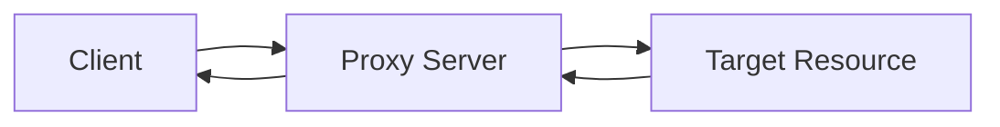
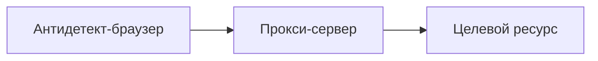

# Как работают прокси

**Прокси-сервер (Proxy)** — это промежуточное звено между клиентом (например, браузером или ботом) и целевым ресурсом (например, сайтом, API или сервером). Прокси принимает ваш запрос, обрабатывает его и отправляет от своего имени. Это позволяет скрыть реальный IP, регулировать трафик, обеспечивать анонимность, автоматизировать действия и масштабировать процессы.

---

## ⚙️ Принцип работы прокси: пошагово



1. **Вы (клиент)** отправляете запрос — например, на открытие сайта.
2. **Прокси** получает этот запрос, меняет отправителя (IP и заголовки) на свои параметры.
3. Прокси **пересылает запрос** целевому сайту или API.
4. Целевой сайт **отвечает прокси**, как будто это и был настоящий клиент.
5. Прокси **передаёт ответ** обратно вам.

**Результат**: сайт видит не ваш IP, а IP прокси, и не может связать вас с запросом напрямую.

---

## 🎯 Что прокси делают в реальности

| Функция                     | Описание                                                                 |
| --------------------------- | ------------------------------------------------------------------------ |
| **Скрытие IP**              | Маскируют реальное местоположение и личность клиента                     |
| **Управление трафиком**     | Направляют, фильтруют и контролируют сетевые запросы                     |
| **Ротация IP-адресов**      | Постоянная смена IP для избежания блокировок и обнаружения               |
| **Обход антибот-систем**    | Прокси + антидетект-браузер позволяют обмануть даже продвинутые защиты   |
| **Фарм и автоматизация**    | Многопоточность без риска бана, создание аккаунтов, взаимодействие с API |
| **Парсинг и анализ данных** | Обход ограничений, капч, банов и блокировок при массовом скрейпинге      |

---

## 🔌 Как прокси подключаются

Подключение к прокси можно осуществить в разных форматах:

### 🧩 Формат строки подключения

```
ip:port:username:password
```

Пример:

```
123.123.123.123:10000:user1:pass123
```

Также вы можете использовать **прокси-ссылки** в формате:

```
http://user:pass@ip:port
socks5://user:pass@ip:port
```

---

## 📡 Протоколы работы прокси

Прокси могут использовать разные протоколы:

| Протокол   | Особенности                                                                                |
| ---------- | ------------------------------------------------------------------------------------------ |
| **HTTP**   | Передача HTTP-запросов, редактирование заголовков, часто используется в браузерах          |
| **HTTPS**  | Шифрованные запросы, подходит для доступа к защищённым сайтам                              |
| **SOCKS5** | Универсальный, поддерживает любой трафик (включая WebRTC, SMTP, FTP) и идеален для антиков |

Подробнее:

* [Что такое HTTP/HTTPS-прокси](../протоколы-прокси/что-такое-http-https-прокси.md)
* [Что такое SOCKS5-прокси](../протоколы-прокси/что-такое-socks5-прокси.md)

---

## 🧠 Типы прокси в Mango Proxy

Мы предоставляем три основных типа прокси:

| Тип                | Описание                                                                              |
| ------------------ | ------------------------------------------------------------------------------------- |
| **Резидентские**   | IP от реальных пользователей, выглядят максимально "живыми", проходят антиботы        |
| **ISP-прокси**     | Гибрид серверных и домашних IP, высокая стабильность + легитимный вид                 |
| **Дата-центровые** | Серверные прокси с высокой скоростью, идеально подходят для скрейпинга и тестирования |

Подробнее:

* [Резидентские прокси](../продукты-и-услуги/типы-прокси/что-такое-резидентские-прокси.md)
* [ISP-прокси](../продукты-и-услуги/типы-прокси/что-такое-isp-прокси.md)
* [Дата-центровые прокси](../продукты-и-услуги/типы-прокси/что-такое-дата-центровые-прокси.md)

---

## 🔁 Ротация: ключевой элемент прокси

Один из важнейших параметров прокси — **ротация IP-адресов**. Она может происходить:

* По **таймеру** (каждые N минут)
* **На каждый запрос**
* **По API-команде**
* При **перезапуске сессии** (в антике)

Это позволяет:

* Увеличить количество допустимых операций в секунду
* Избежать связи между аккаунтами
* Масштабировать фарм, сплит-тесты, рекламу и т.д.

📘 Подробнее: [Что такое динамические прокси](../продукты-и-услуги/типы-прокси/что-такое-динамические-прокси.md)

---

## 🧱 Как связать прокси и антидетект-браузер

Прокси работают в связке с **антидетект-браузерами**:



Антидетект-браузер создаёт уникальный **браузерный отпечаток (fingerprint)**
Прокси подставляет уникальный **IP-адрес**
📈 Итог: платформа считает, что это уникальный, настоящий человек

Инструкции:

* [Интеграция с Octo Browser](../../браузеры/антидетект/octo.md)
* [Интеграция с Dolphin Anty](../../браузеры/антидетект/dolphin-anty.md)

---

## 🔍 Прокси как инструмент

Mango Proxy предоставляет **прокси-инфраструктуру**, заточенную под задачи:

* Фарма (создание и прогрев аккаунтов)
* Арбитража трафика и запуска рекламы
* Парсинга и сбора данных
* Тестирования и автоматизации

Всё управление происходит из [личного кабинета](../../начало-работы/настройка-прокси.md), включая:

* Выбор протокола
* Настройку ротации
* Фильтрацию по стране, ASN, ZIP
* Форматы для антиков

---

## ✅ Резюме

| Компонент        | Описание                                                 |
| ---------------- | -------------------------------------------------------- |
| IP-адрес         | Заменяется на IP прокси                                  |
| Протокол         | HTTP, HTTPS, SOCKS5                                      |
| Сессия           | Поддержка статических и динамических сессий              |
| Анонимность      | Высокая, особенно с резидентскими и SOCKS5               |
| Масштабируемость | До тысяч запросов в секунду                              |
| Антидетект       | Поддерживается полностью, интеграции с топовыми антиками |

---

## 📘 Полезные материалы

* [Настройка прокси](../../начало-работы/настройка-прокси.md)
* [Что такое динамические прокси](../продукты-и-услуги/типы-прокси/что-такое-динамические-прокси.md)
* [Сценарии использования](../../варианты-использования/)
* [Интеграция с антидетект-браузерами](../../браузеры/антидетект/)
* [Выбор протокола](../протоколы-прокси/)
