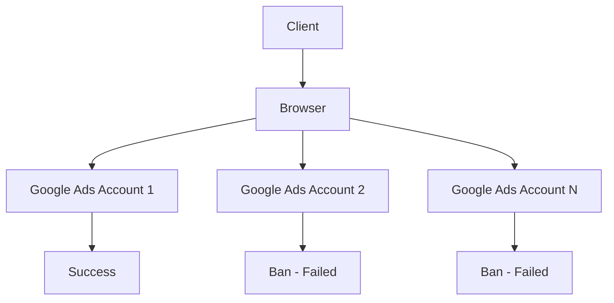
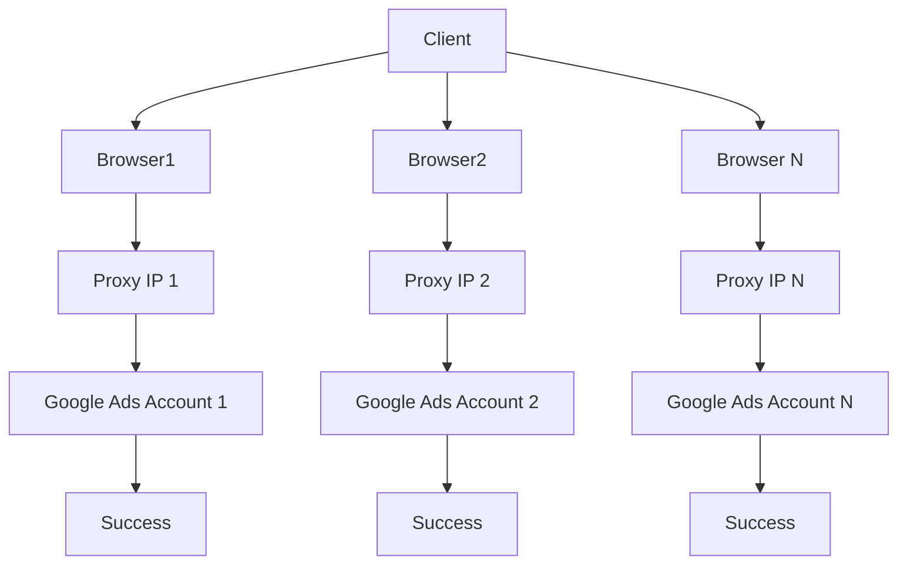

# Что такое прокси?

**Прокси-сервер** (от англ. *proxy* — "представитель", "заместитель") — это промежуточное звено между вашим устройством (клиентом) и интернет-ресурсами, к которым вы обращаетесь. Он получает ваши запросы, передаёт их от своего имени, а затем возвращает ответ. Таким образом, ваш **реальный IP-адрес остаётся скрытым**, а сайты "видят" IP прокси-сервера.

Если упрощённо — это как «маска», которую вы надеваете перед входом в интернет.

---

## Зачем нужны прокси?

Прокси-серверы выполняют критически важные задачи для безопасной, масштабируемой и стабильной онлайн-работы. Ниже — ключевые причины, по которым прокси становятся обязательным инструментом в 2025 году.

### 🔐 Анонимность и защита данных

- **Скрытие IP-адреса.** Сайты не видят ваш реальный IP. Это делает поведение в интернете анонимным и защищённым от отслеживания, fingerprint-анализа и нежелательных связей между аккаунтами.
- **Работа с несколькими личностями.** Прокси позволяют изолировать аккаунты друг от друга, распределяя их по разным IP, браузерным сессиям и устройствам.
- **Безопасность в открытых сетях.** Использование прокси снижает угрозу перехвата трафика и отслеживания в открытых Wi-Fi.

👉 Подробнее: [настройки аккаунта](../начало-работы/настройки-аккаунта.md)

---

### ⚙️ Масштабируемая работа с аккаунтами и трафиком

Если вы работаете с десятками или сотнями аккаунтов (в арбитраже, e-commerce, рекламе, соцсетях и т.п.), **один IP = один аккаунт**. При использовании одного IP на нескольких аккаунтах возникает риск блокировок и деанонимизации.

С помощью прокси вы:

- изолируете каждый аккаунт,
- обеспечиваете уникальный IP под каждый поток,
- снижаете риск банов и увеличиваете масштаб.

🔥 Подробнее: [антидетект-браузеры](../браузеры/антидетект/)

---

### 📊 Автоматизация, парсинг, тестирование

Прокси — это основа для:

- автоматического сбора данных (парсинг SEO, маркетплейсов, конкурентного анализа),
- тестирования интерфейсов и API,
- работы с маркетинговыми инструментами (например, верификация объявлений, price scraping).

🔥 Подробнее: [зачем бизнесу прокси](../варианты-использования/зачем-бизнесу-прокси.md)

---

## Прокси vs VPN — в чём отличие?

| Характеристика        | VPN                                          | Прокси                                         |
|------------------------|-----------------------------------------------|------------------------------------------------|
| Масштабируемость       | ❌ 1 пользователь = 1 IP                      | ✅ 1 пользователь = 10 000+ IP / сек           |
| Гибкость подключения   | Только вся система (весь трафик)             | Конкретные приложения, браузеры, API          |
| Цель                   | Безопасность и приватность                   | Масштаб, контроль, анонимность, парсинг       |
| Идеален для            | Обычных пользователей                        | Арбитражников, разработчиков, маркетологов    |

🔥 Подробнее: [что такое прокси-сервис](../основы-прокси/что-такое-прокси-сервис.md)

---

## Без прокси: как аккаунты банятся

❗ Всё работает через один и тот же IP. Платформа (например, Google Ads) видит подозрительную активность, связывает аккаунты между собой — и отправляет их в бан.

---

## С прокси: идеальная изоляция и масштаб

✅ Каждый браузер использует уникальный IP, уникальный fingerprint и канал подключения. Блокировки исключены.

---

## Mango Proxy — больше, чем просто IP

Платформа Mango Proxy предлагает:

* мгновенный доступ к миллионам IP по всему миру;
* гибкую настройку: GEO, ASN, ZIP, ротация;
* разные типы: резидентские, дата-центровые, ISP;
* поддержку HTTP, HTTPS, SOCKS5;
* интеграции с 20+ антидетект-браузерами;
* API для автоматизации;
* webhook для контроля расходов;
* понятный дашборд в реальном времени.

🔥 Подробнее:

* [что такое резидентские прокси](../продукты-и-услуги/типы-прокси/что-такое-резидентские-прокси.md)
* [что такое ISP-прокси](../продукты-и-услуги/типы-прокси/что-такое-isp-прокси.md)
* [что такое SOCKS5-прокси](../продукты-и-услуги/протоколы-прокси/что-такое-socks5-прокси.md)
* [настройка прокси](../начало-работы/настройка-прокси.md)

---

## Готовы начать?

📌 Прокси — это не просто инструмент для «обхода», это ядро масштабируемой цифровой инфраструктуры.
С ними вы:

* защищаете свои активы,
* получаете гибкость и контроль,
* создаёте устойчивые системы,
* масштабируетесь без риска банов.

👉 Начните с [регистрации](../начало-работы/регистрация.md) и [настройки прокси](../начало-работы/настройка-прокси.md)
